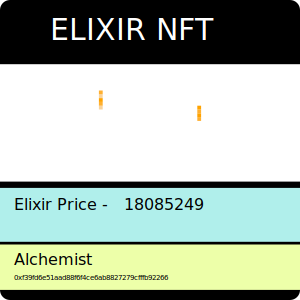

# Steady DAO


- [Steady DAO](#steady-dao)
  - [Introduction](#introduction)
  - [Roadmap](#roadmap)
  - [Steady DAO Mint Economic Model](#steady-dao-mint-economic-model)
    - [Scenario](#scenario)
  - [Benefits to the Steady DAO holder](#benefits-to-the-steady-dao-holder)
  - [Dynamic Fees](#dynamic-fees)
    - [Simulations](#simulations)
  - [How to list your chyme](#how-to-list-your-chyme)
  - [Alchemist Rules](#alchemist-rules)
  - [How we used Steady DAO Dynasty tokens](#how-we-used-steady-dao-dynasty-tokens)
  - [Steps](#steps)
    - [STEP 1 - CREATE CHYME	CreatNewChyme](#step-1---create-chymecreatnewchyme)

  
## Introduction
The inspiration for Steady DAO is from the fact that in today's crypto landscape there are multiple
stable coin implementations that are not backed by real physical assets. This lends to increased risk, for eg
see USDT and USDC both started out as redeemable and backed assets over time this has changed. 

Steady DAO creates Steady assets that are backed by real physical assets with great transparency. 
The model gives you the user an opportunity to split your tokens into the current USD value and another NFT, which
represents the volatility of the underlying collateral. We believe that decentralization requires a strong foundation.

## Roadmap

| Quarter  	|  Event 	| Goals  	| Gamefication  	|  Land Used 	|  
|---	|---	|---	|---	|---	|
|22-Q1	| Steady DAO Alchemist | The Alchemist allows the Steady DAO to create a foundational value with an underlying redeemable asset backed token. |1. Basic Animation 1. Gamification of closing mature options and earning rewards. 2. Make fees lower based on correct timing.|The Mint
|22-Q2|Steady DAO Stabilizer|This allows the economy to maintain a stable value for the steady token. A model similar to the maker dao model of auctioning collaterals that the treasury buys based on thresholds is created|1. Spotter - A spotter is someone who sirens that there is a deviation from price 1. First Responders - Responders who decide immediate action. Both spotters and Responders for actions(game elements) leading to stability earn rewards|The Reserve
|22-Q3|Steady DAO Land Sales and Adventurers|Proximity based land allocation giving rewards to different areas based on growth. Adventurers who can be upgraded over time with PvP battles and equipments. Adventurers earn higher rewards for staking throughout the lands, based on their reputation|1. Land System 2. PvP and Player shops|Stage 1 - Lands
|22-Q4|Steady DAO Dynasty Bank |The banking system within the DAO where yields are generated from bonds and also with merger of other dApp's  and protocols|1. Basic Animation 2. Become the Governor competitions|The Central 
|23-Q1|Steady DAO Dynasty Souq|Integrate other dApp's into the system, new DeFi projects, forks of existing protocols etc|1. Basic Shopfront 2. Custom Animations 3. Staking rewards based on mini games|The Souq
|23-Q2|Steady DAO Dynasty Adventure Guilds|Allows mini DAO formation||The Barracks
|23-Q3|Steady DAO Dynasty Quests|Create gamified quests where players earn rewards for completing quests|Adventure quests developed by Indie developers with various difficulties|The Leaky Tavern
|23-Q4|Steady DAO Guild Wars|Yearly full blown quest between mini DAO's to get a shot at winning the rigths to be the governor|Guild Vs Guild Battles|The Arena

## Steady DAO Mint Economic Model
| Invest  	|  Time 	|  Gold Price 	|  Steady ERC20 	|  Elixir 	|  Elixir NFT 	| Ratio	|   Forge Price  	|
|---	|---	|---	|---	|---	|---	|---	|---	|
|Invest 1| T1|  50| 37.5|  12.5| 1| 0.25|  50| 0
|Invest 1| T2|  60| 37.5|  22.5| 1| |  50| 6
|Invest 2| T3|  60| 45|  15| 1| 0.25|  60| 12
|Invest 1| T4|  65| 37.5|  27.5| 1| |  50| 24
|Invest 2| T4|  65| 45|  20| 1| |  60| 24|  | |  
|Invest 1| T5|  30| 37.5|  -7.5| 1| |  50| 32
|Invest 2| T5|  30| 45|  -15|  1|  | 60|  32

### Scenario
1. User does a split at T1 which is same as birth price = $50, user gets 37.5 Steady tokens and .25 of the original token if he is splitting 1 unit
2. if User does a merge later at time T2 then if price appreciates to $60
 the user will require 1 Elixir NFT with a value of 12.5 and 37.5 Steady tokens to get a Full GOLD GRAM token back, where price of GOLD GRAM Token = $60. 
The user has thus redeemed this for $50 and sold it for $60 and netted a payout of $10.
3. If the user does a merge later at time T5 when price is gone down to 30 then the user requires 37.5 steady tokens and his 1 Leveraged token to get back 1 GOLD worth $30. 
However, since his leveraged token value is below 0 we simply do not allow redemptions below 0. Now, the 37.5 $ value which the Steady had, is said to be unbacked. Neverthless,
the total volume of steady minted might still be backed.

The DAO periodically invests and buys into the treasury the approved chymes/commodity assets. 

## Benefits to the Steady DAO holder
Steady DAO Tokens are the limited supply governance tokens for the Steady DAO ecosystem. Steady Token Minting and stabilization of the Steady DAO, depends on the governance decisions taken via staking Steady DAO tokens. Protocol fees are accumulated into the Steady DAO token as well via various mechanisms.

## Dynamic Fees
1. Fee basis points are decided based on the risk of the chyme itself and transparency in the underlying 
That is if the underlying is less transparent about its backing the chyme will be initiated with a higher fee
2. Fees are charged for splitting and merging
3. Upon merging fees are charged based on the current value of the underlying
4. Rewards are only issued for closing mature chymes

### Simulations
TODO

## How to list your chyme
In order to list your chyme, please create a pull request with ChymeList.json and mention the details required.

## Alchemist Rules
Tokens in each pool can only be split for a period of 1 month. 
After a period of 1 month from the launch of the pool. 
No more tokens can be SPLIT at that price.

Elixir tokens post the maturity date can be closed by any party 
that sends the Elixir token id and required amount of steady tokens to close it, for a reward.
The underlying chyme is send to each party in the respective amounts.
Till the maturity period however only the token owner can close it.

## How we used Steady DAO Dynasty tokens
Our two way token linked with Steady DAO Dynasty - As part of the bigger project, we have a two token ecosystem wherein Steady DAO tokens can be exchanged for Steady DAO Dynasty "Play to earn tokens" and vice versa. 

This allows us to integrate existing and future DeFi applications into our ecosystem in a meaningful way and pave way for building "Our Souq", wherein DeFi merchants can sell their wares in our ecosystem with a simple wrapped token concept.


## Steps 
### STEP 1 - CREATE CHYME	CreatNewChyme

```
	CGT Master Contract Address	Input
	CGT Price Feed Address 	Input
	Fees (set by DAO)	Input
	Rewards (set by DAO)	Input
	Approved (set by DAO) ? 	Input
	SteadyRatio 	Input
	YearsToMaturity 	Input
	Underlying Information	Input
	AlchemistD  (Auto Creation, 1 to 1  with price)	Derived
	Forge Price (Gold Price in USD Instance)	Derived
```	

### STEP 2 - CREATE ALCHEMIST	

```
  Forge Price	Given
	AlchemistD	Given
	Split The Chyme 	
	 --  Amount (e.g. CGT)	
	Merge into Chyme	
	 --  Amount (e.g. CGT)	
```

### STEP 3 	

```
  Amount 1 Chyme 	Input
	Output Steady tokens (Forge Price x ratio)	Derived
	Output Elixir - (1 NFT)	
	     ELIXIR ID  (Unique is AlchemistID + ElixirID)	Derived
	     TimeStamp (decimal)	Derived
	      Elixir Amount	Derived
```
		
		
### STEP 4
```
Amount to merger (1 Chyme) 	Input
	    SteadyTokensForMergeCost - Output Steady tokens (Forge Price x ratio) x amount	37.5
	   Commit Suicide of the NFT based on the value and create new if any remaining value	
	   Release CGT 	1 Chyme 
		
	MergeSteadyAddress (non-self allowed depending on maturity)	
```


### NFT Attributes




```
	ElixirCurrentSteadyValue	(CurrentFeedPrice - (Forge Price x ratio)) x amountChyme
	ElixirOriginalSteadyValue	Forge Price x (1-ratio) x amountChyme
	TimeToMaturity	Current BlockTimestamp - (Timestamp + YearsToMaturity)
```

# Setting up

1. For the contracts ``` cd steady-hardhat ```
2. Run yarn at the top level
3. yarn add ts-node 
4. npx hardhat compile
5. update .env.example -> .env

# Deploying 

This alchemist requires the address of the base token and the chainlink oracle for deployment. This is a factory contract, use npx hardhat run scripts/deploy.ts followed by custom.ts

# Testing 

```
npx hardhat test
```

## Coverage

We had added coverage, but during the hackathon this is broken.

```
npx hardhat coverage
```
