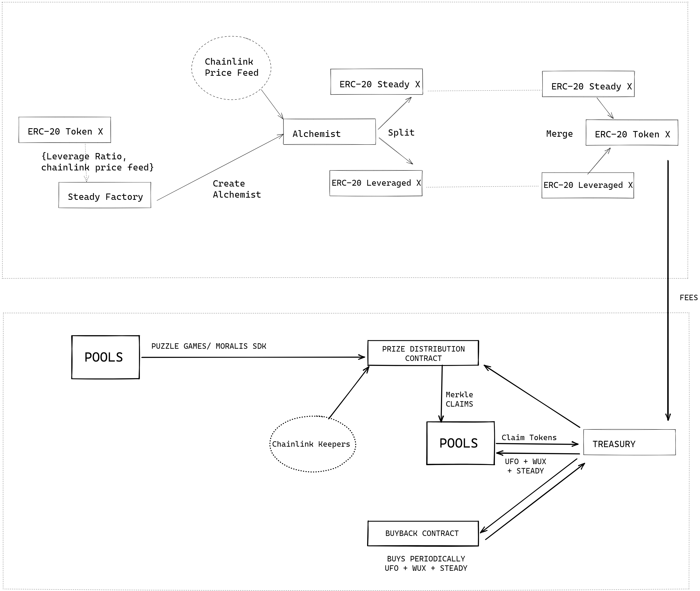

# Steady DAO - Chainlink Hackathon 2021


# Basics

<p align="center">
  
</p>


At the base a contract that splits a token based on the latest chainlink price into 2 tokens, one token will be the same as the original token and will hold all of its properties.

Another is based on the current USD value of that token.

The equation that we use is 
if K denotes the original token amount, 
let X denote the Steady token,
Y the Unsteady token and if the ratio of M:N = 1:2 then
Z denote the price at contract creation time = max(1, priceFromOracle());

As a user for this pool - Token X Price - (Z)       
 X = K * .75 * uint(Z)
 Y = K * 1 [Thus this token holds the remaining value logically]

Anyone is free to create their base metals from their own CHYME (ALLOY). Upon splitting we intend to give the users Steady DAO and UFO tokens from the treasury.

## Tokenomics

1. Money Out - We give 10 Steady DAO token on splitting and 100 Steady DAO tokens for creating a new pool, We give 1 Steady DAO token for merging. 
1. All these guages related to STEADY DAO token rewards can be modified by the DAO.
1. Money In - We charge 200 basis points or 2% on merge in the underlying, and 10 basis points on SPLIT from the underlying
1. BuyBack - 1% of the fees from the underlying across alll projects will be used to buyback Steady DAO tokens every X blocks

## IMPORTANT SAFETY NOTICE 
Tokens in each pool can only be split for a period of three months. After a period of three weeks from the launch of the pool. No more tokens can be SPLIT at that price.

Elixir tokens that have not been merged for more than 3 years are liable to be blocked from transfer. The transfer lock does not prevent the user from merging.
This incentivices Elixir token holders to not HODL for more than 3 years and improves liquidity.

## How we used moralis

We managed to integrate moralis into gamemaker studio 2 which we think is a huge boon to the indie dev community. We use moralis to create a database for contract events and to trigger in game actions based on this.

## How we used UFO tokens
Our two way token linked with UFO - 
https://mumbai.polygonscan.com/address/0x738C763dC38751Fc870a1B24ab23a7A36591005C

Everytime someone splits a CHYME, a small amount of UFO is given to the splitter. The platform then collects fees on Merge (TODO: collect fees), which is then utilized to buy more UFO/SteadyDAO tokens.

## How we used chainlink keepers

We utilized chainlink keepers to do a prize distribution across pools, or across DAO's. The keepers in every epoch calls our Merkle Distributor contract
and stores the merkle hash for that epoch.

### Deployed Addresses
#### Keeper
https://keepers.chain.link/mumbai/144 

#### Upkeep contract
This runs every epoch and calls the api contract(Right now we used a dummy api contract)
Using Dummy API - 
https://mumbai.polygonscan.com/address/0x0680a4A953952329A5241c284146DDD9d5adBD6E#readContract


## How we used chainlink api oracle
We used chainlink oracle to get the latest merkle hash that must be pushed into the Merkle Distributor contract.
https://mumbai.polygonscan.com/address/0xA7f820c64184142ea73cbf02cd1412e2B4cdA446#code

# Setting up
1. Run yarn at the top level
2. For the contracts ``` cd steady-hardhat ```  
3. yarn add ts-node 
4. npx hardhat compile
5. update .env.example -> .env
# Deploying 
This alchemist requires the address of the base token and the chainlink oracle for deployment. This is a factory contract, use npx hardhat run scripts/deploy.ts followed by custom.ts

# Testing 
```
npx hardhat test
```

## Coverage
We had added coverage, but during the hackathon this is broken.

```
npx hardhat coverage
```
